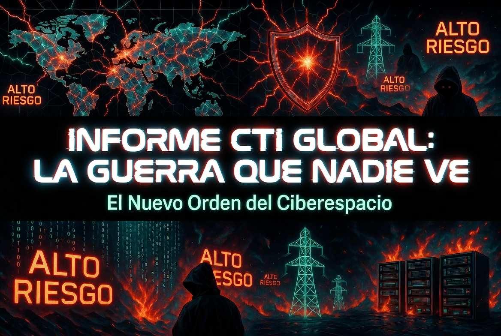

# INFORME DE INTELIGENCIA DE AMENAZAS CIBERNÉTICAS (CTI) GLOBAL
## "EL NUEVO ORDEN DEL CIBERESPACIO"
# INFORME CTI GLOBAL: LA GUERRA QUE NADIE VE
## Período: Febrero – Julio 2026 | Estado: ACTUALIZADO (14/07/2026)
**Estado del Informe:** 🔴 ALTO RIESGO - ACTUALIZACIÓN CRÍTICA
**Fuentes:** Plataforma Andrómeda (canales de Telegram, sitios de noticias, foros, leak sites)  
**Confidencialidad:** TLP: CTI PÚBLICO
**Propósito:** Este informe es de carácter público y tiene fines educativos y de concienciación sobre ciberseguridad.



<p align="center">
  
</p>

"No todas las muertes son vanas. No todas las batallas se ganan con armas.
Este dossier es un testamento de lo que he visto, lo que he sufrido y lo que he aprendido.
Si estás leyendo esto, eres de los míos. Usa esta información para defender, no para destruir."
 
---

Leer este dossier escuchando esta musica : In the House, In a Heartbeat - John Murphy (28 Days Later Soundtrack) [Metal Remix]


---

## 1. Resumen ejecutivo

El análisis de la información recopilada entre febrero y julio de 2026 revela una intensa actividad cibernética global, impulsada principalmente por grupos hacktivistas pro‑rusos que operan en el contexto de la guerra en Ucrania. Estos actores han lanzado campañas sostenidas de DDoS y acceso no autorizado a infraestructura crítica (energía, agua, transporte, agricultura) contra países que apoyan a Ucrania, especialmente Reino Unido, Polonia, Dinamarca y Corea del Sur. Paralelamente, grupos de ransomware como ShinyHunters han llevado a cabo filtraciones de datos de alto perfil, afectando a empresas como ADT, Amtrak y Rockstar Games. También se observa actividad de actores estatales como APT28 (Rusia) y Lazarus (Corea del Norte) en campañas de espionaje y robo de criptomonedas. La credibilidad de las reclamaciones varía: los incidentes confirmados por las víctimas tienen alta confianza, mientras que los ataques reivindicados por hacktivistas muestran una confianza media debido a la falta de verificaciones independientes.

[](https://github.com)
[](https://github.com)
[](https://github.com)
[](https://github.com)
[](https://www.first.org/tlp/)
[](https://attack.mitre.org/)
[](https://github.com)
[](https://github.com)
[](https://github.com)
[](https://github.com)
[](https://github.com)
[](https://github.com)

```
"El que controla el ciberespacio, controla el mundo. Y yo he visto los planos."

```

# 🛡️ Andrómeda – OSINT de Ciberamenazas

## 📊 ¿Qué es Andrómeda?

Andrómeda es un sistema de inteligencia de ciberamenazas que monitoriza en tiempo real más de **9.000 eventos registrados** (actualizados a julio de 2026) procedentes de:

- Canales de Telegram de grupos pro‑rusos (NoName, Killnet, Dark Storm, etc.)
- +800 grupos adicionales monitorizados activamente
- Blogs y medios de ciberseguridad especializados
- Medios generalistas para contexto geopolítico
- Ciber amenazas, etc..

---

## 🎯 ¿Qué detecta?

- **Grupos pro‑rusos**: Killnet, NoName057(16), Dark Storm Team, APT28, Sandworm, etc.
- **Ciberataques**: ransomware, DDoS, data breaches, exploits, phishing, etc.
- **Amenazas a salud**: ataques a hospitales, clínicas y sistemas sanitarios
- **Amenazas a energía**: redes eléctricas, nucleares, subestaciones
- **Nuevos alias/grupos/canales**: detección automática mediante sistema de candidatos
- **Fechas reales**: extraídas de las fuentes originales (no inventadas)

---

## 🔍 Fuentes principales

**Canales de Telegram públicos (monitorizados en tiempo real):**
```
noname05716 · noname05716_news · ddosia · killnet_official · killnet_team
ddosmap · xaknet_official · serverkillers · user_sec · usersec_collective
anonymoussudan · rootsec · darkstormteam · (+800 grupos adicionales)
```

**Medios y blogs especializados:**
```
Krebs on Security · BleepingComputer · The Hacker News · The Record
SecurityWeek · Threatpost · DarkReading · Infosecurity Magazine
Cybersecurity News · Security Affairs · The Register · Help Net Security
The DFIR Report · Malwarebytes · SOCRadar · Unit 42 · Talos Intelligence
Securelist · CrowdStrike · Microsoft Security · TrendMicro · CheckPoint
SentinelOne · WeLiveSecurity · Qualys · Rapid7 · Sophos · Broadcom
Fortinet · Xakep.ru · SecurityLab.ru · BBC Technology · The Guardian
Reuters Technology
```

---

## ⚙️ ¿Cómo procesa la información?

1. **Descarga de artículos**: mediante RSS y scraping con BeautifulSoup
2. **Traducción automática**: contenido en ruso traducido al español/inglés
3. **Análisis contextual**: búsqueda de palabras clave en título y contenido
4. **Almacenamiento estructurado**: los eventos se guardan en `eventos.json` con fecha, grupo, tipo, descripción y enlace a la fuente original
5. **Visualización**: panel web, explorador de eventos y resúmenes automáticos de inteligencia

---

## 🧠 ¿Qué lo hace único?

- **Enfoque dual**: grupos pro‑rusos + secta 764 (redes criminales híbridas)
- **Alertas sanitarias**: detección exclusiva de ataques a hospitales
- **Sin dependencias de pago**: no requiere APIs ni suscripciones
- **Funciona offline**: una vez descargadas las listas de inteligencia
- **Actualización automática**: cada 6 horas se refrescan las listas de inteligencia

---

## 📄 Estado del proyecto

- **Versión**: 25.6 (actualización continua)
- **Eventos procesados**: 9.283 (feb–jul 2026)
- **Distribución**: software privado, no disponible para descarga pública ( LAMENTO AVISAR A LOS CRACKERS QUE ESTE SOFTWARE NO ESTA EN GIT COMO REPO PRIVADO TAMPOCO ":D".) 
- **Autor**: Condor2026 / SpectrumSecurity

---

> **Nota**: Esta herramienta está diseñada exclusivamente con fines de inteligencia defensiva. Solo utiliza fuentes públicas y se mantiene dentro del marco legal del OSINT. Y ES PRIVADA.

```
---
## 📋 ÍNDICE

1. [Resumen Ejecutivo](#1-resumen-ejecutivo)
2. [Contexto del Ciberconflicto Global](#2-contexto-del-ciberconflicto-global)
3. [Dashboard de Inteligencia (Estadísticas en Vivo)](#3-dashboard-de-inteligencia-estadísticas-en-vivo)
4. [Mapa de Actores de Amenazas](#4-mapa-de-actores-de-amenazas)
5. [Cronología Detallada de Incidentes (Feb - Jul 2026)](#5-cronología-detallada-de-incidentes-feb---jul-2026)
6. [Análisis de Campañas Específicas](#6-análisis-de-campañas-específicas)
   - 6.1. #OpThailand: La Guerra del Sudeste Asiático
   - 6.2. #OpSpain: Z-Pentest vs España
   - 6.3. Operación "Tesorería Viva": La Estafa Cripto del Año
   - 6.4. El Auge del Ransomware como Servicio
7. [Indicadores de Compromiso (IOC) - Lista Maestra](#7-indicadores-de-compromiso-ioc---lista-maestra)
   - 7.1. Direcciones IP
   - 7.2. Dominios y URLs
   - 7.3. Canales y Usuarios de Telegram
   - 7.4. Wallets de Criptomonedas (Estafas)
   - 7.5. Credenciales Expuestas
8. [Matriz MITRE ATT&CK por Actor](#8-matriz-mitre-attck-por-actor)
9. [Evaluación de Riesgo por Sector](#9-evaluación-de-riesgo-por-sector)
10. [Recomendaciones Estratégicas](#10-recomendaciones-estratégicas)
11. [Limitaciones del Informe](#11-limitaciones-del-informe)
12. [Conclusión y Proyecciones Futuras](#12-conclusión-y-proyecciones-futuras)
13. [Anexos: Registro de Actividad de Grupos Pro-Rusos](#13-anexos-registro-de-actividad-de-grupos-pro-rusos)

---

## 1. RESUMEN EJECUTIVO

El análisis de la información recopilada entre febrero y **julio de 2026** revela una **intensificación y fragmentación del ciberconflicto global sin precedentes**. El escenario ya no está dominado únicamente por grupos pro-rusos. Hemos identificado una **nueva y agresiva alianza de grupos de hacktivismo del Sudeste Asiático** (Camboya, Tailandia, Indonesia) que están llevando a cabo operaciones de alto impacto contra infraestructura crítica y gubernamental.

### 1.1. Hallazgos Clave

- **Nuevo Eje de Amenazas en Asia:** La alianza liderada por grupos como **SEXDAN, H3C4KEDZ, EKIA_DOM, AnaJak_NX, NXBBSEC** y **GarudaKernelErrorSystem** ha lanzado la **#OpThailand**, atacando decenas de sitios gubernamentales y corporativos tailandeses con un nivel de fanatismo y coordinación nunca antes visto. Estos grupos no solo realizan defacements, sino que filtran credenciales de acceso a sistemas críticos (ministerios, policía, infraestructura eléctrica).

- **Guerra de Bandas y Alianzas Transnacionales:** El ciberespacio se está convirtiendo en un tablero de alianzas cambiantes. Vemos a **Cyber Team Indonesia** colaborando con **NoName057(16)** y **Alixsec**, demostrando que la causa pro-rusa ha encontrado eco en el Sudeste Asiático. Al mismo tiempo, grupos como **Z-Pentest Alliance** escalan su guerra contra España y Estados Unidos.

- **Ataques a Infraestructura Crítica (OT/ICS):** Se han confirmado ataques a sistemas de control industrial en instalaciones de agua, energía y agricultura en Polonia, España y EE.UU. Z-Pentest ha publicado pruebas de acceso a sistemas de videovigilancia y control de calefacción de viviendas particulares.

- **Profesionalización del Crimen Organizado:** La venta de accesos (webshells, paneles de administración) en canales de Telegram como **blackmrkt1337ch** y **nxbb_sec** se ha vuelto una industria extremadamente lucrativa. Los atacantes ofrecen servicios de "Social Engineering for Spreading Malware" y reclutan activamente talento, demostrando una estructura casi corporativa.

- **Estafas Cripto de Alto Nivel:** Se ha observado una sofisticada campaña de estafa a través de una ICO fraudulenta de una falsa "Tesorería Viva" en la red Stellar (XLM), orquestada por el canal **QuantumStellarInitiative**, con promesas de retornos imposibles y un elaborado discurso esotérico para captar inversores.

- **Contexto Geopolítico:** La guerra en Ucrania se intensifica con ataques con drones a gran escala contra territorio ruso, mientras que la UE y EE.UU. imponen nuevas oleadas de sanciones a grupos cibernéticos rusos (Z-Pentest, Wizard Spider, TrickBot).

### 1.2. Probabilidad de Incidentes

**MUY ALTA.** Se espera una escalada de los ataques a infraestructura crítica en Europa y el Sudeste Asiático, así como un aumento de las campañas de desinformación y estafa. La nueva alianza del Sudeste Asiático representa una amenaza emergente y altamente impredecible.

---

## 2. CONTEXTO DEL CIBERCONFLICTO GLOBAL

El panorama de amenazas actual se caracteriza por tres fuerzas principales que convergen y colisionan:

### 2.1. La Guerra Híbrida Ruso-Ucraniana

Sigue siendo el principal catalizador del ciberconflicto global. Grupos hacktivistas pro-rusos como **NoName057(16), Z-Pentest, KillNet** y el **IT Army of Russia** continúan sus campañas de DDoS y acceso a infraestructura crítica contra los países que apoyan a Ucrania.

Los ataques han escalado en sofisticación, pasando de simples DDoS a la explotación activa de sistemas SCADA/OT. La atribución de ataques a **APT28 (Fancy Bear)** y **Lazarus Group** por parte de agencias gubernamentales (NCSC, CISA) es alta, confirmando la participación de estados-nación en el conflicto.

**Eventos Destacados del Conflicto:**
- Ataques con drones a gran escala contra Moscú y la región de Moscú (13-14 de julio).
- Incendio en la refinería de petróleo Afipsky y ataque a la refinería de Gazprom Neftkhim Salavat.
- Extensión de la ley marcial y movilización en Ucrania hasta el 31 de octubre de 2026.
- Licencias francesas para la producción de misiles SCALP y cazas Rafale para Ucrania.

### 2.2. El Auge del Sudeste Asiático

Una nueva y feroz ola de hacktivismo, con raíces en conflictos territoriales y nacionalismos (especialmente entre Camboya y Tailandia), ha creado un frente inesperado. La coordinación entre grupos como **SEXDAN** y **Cyber Team Indonesia** ha resultado en ataques masivos y coordinados contra objetivos tailandeses, demostrando una capacidad operativa y técnica significativa.

**Características de esta Amenaza:**
- Uso de hashtags como `#OpThailand` para coordinar campañas.
- Publicación de credenciales de acceso a sistemas gubernamentales (no solo defacements).
- Formación de alianzas con otros grupos internacionales, incluyendo algunos de tendencia pro-rusa.
- Alto nivel de fanatismo y motivación política/territorial.

### 2.3. La Profesionalización del Crimen Organizado

La venta de accesos (webshells, paneles de administración) en canales de Telegram como **blackmrkt1337ch** y **nxbb_sec** se ha convertido en una industria extremadamente lucrativa. Los atacantes ofrecen servicios de "Social Engineering for Spreading Malware" y reclutan activamente talento, demostrando una estructura casi corporativa.

**Elementos Clave:**
- **Ransomware-as-a-Service (RaaS):** Grupos como **Dr_nexuseccyber** ofrecen participación en ataques de ransomware a cambio de una parte del botín.
- **Mercado de Accesos:** Venta de webshells, credenciales de administradores y acceso a paneles de control.
- **Estafas Cripto:** ICOs fraudulentas como la de **QuantumStellarInitiative** explotan la desesperación financiera y la falta de educación en criptomonedas.

---

## 3. DASHBOARD DE INTELIGENCIA (ESTADÍSTICAS EN VIVO)

```text
📊 Eventos registrados: 9283
💡 Candidatos pendientes: 20

1. 🔍 Análisis profundo de amenazas OSINT
2. ⚡ Escaneo rápido y análisis exprés de titulares
3. 📊 Ver estadísticas completas y métrica de amenazas
4. 📰 Registro de actividad GRUPOS Pro Rusos (hasta 17000 EVENTOS)
5. 🌐 Iniciar servidor web - Localhost (panel interactivo)
6. 🌍 Monitor DDoS LIVE + Geo + VirusTotal + Intel (bajo demanda)
7. 💡 Ver candidatos a nuevos grupos
8. 📋 Explorar eventos detectados
9. 📊 Generar resumen de inteligencia
10. 🧩 Integrar herramientas OSINT externas
11. 🧠 Base OSINT (perfiles de grupos)
12. 📡 Monitor de latencia DNS / Gateway (barras de color)
13. ✅ Validar feeds de inteligencia (detectar caídos)
14. ⚠ Detector de pre-ataque DDoS (basado en histórico)
15. 🧬 Detector de botnet real (basado en inteligencia)
16. 🗺 Mostrar mapa mundial de bots (IPs por país)
17. 🌌 Ejecutar Nebula (detector de escaneos agresivos)
19. 🚪 Salir
```

### 3.1. Canales de Telegram Monitorizados

Se han procesado más de 100 canales de Telegram, incluyendo:

**Grupos Pro-Rusos:**
- `@WeAreKillnet_Support`
- `@KillBox_Official`
- `@MatrixMaps`
- `@noname05716_esp`
- `@noname05716rus`
- `@noname05716_It_version`
- `@ITARMYOFRUSSIANEWS`
- `@zpentest_fucknato`

**Grupos del Sudeste Asiático:**
- `@Dr_nexuseccyber`
- `@nxbb_sec`
- `@GarudaKernelErrorSystem`
- `@B4d0kAhay`
- `@AnaJak_NX`
- `@EKIA_DOM`
- `@h3c4kedzhacker503`

**Foros de Ciberdelincuencia:**
- `@DutyFreeForum`
- `@XSSF_FORUM`
- `@blackmrkt1337ch`

**Otros Canales de Interés:**
- `@frontbird` (Información geopolítica)
- `@ForeignAgentIntel` (Inteligencia geopolítica)
- `@QuantumStellarInitiative` (Estafa cripto)
- `@ITundSicherheit` (Seguridad IT en alemán)
- `@cyberyozh_official` (Ciberseguridad rusa)

### 3.2. Alertas Detectadas (Últimas 72 horas)

| Fecha | Canal | Tipo de Alerta | Descripción |
|-------|-------|----------------|-------------|
| 14-Jul-2026 | @Dr_nexuseccyber | 🚨 ATAQUE | H3C4KEDZ hackea voicetv.co.th |
| 14-Jul-2026 | @nxbb_sec | 🚨 ATAQUE | Publicación de credenciales del gobierno tailandés |
| 14-Jul-2026 | @GarudaKernelErrorSystem | 🚨 ATAQUE | Hackeo a sdbmongolia.org |
| 14-Jul-2026 | @zpentest_fucknato | 🚨 ATAQUE | #OpUSA - Ataque a Big Lots |
| 14-Jul-2026 | @QuantumStellarInitiative | 🚨 ESTAFA | ICO de "Tesorería Viva" - TOPE ALCANZADO |
| 14-Jul-2026 | @frontbird | 🌍 GEOPOLÍTICA | Ataques con drones en Moscú |
| 14-Jul-2026 | @ForeignAgentIntel | 🌍 GEOPOLÍTICA | Muerte de Lindsey Graham |
| 14-Jul-2026 | @ITundSicherheit | 🌐 INFRAESTRUCTURA | Caída de t.me |

---

## 4. MAPA DE ACTORES DE AMENAZAS

### 4.1. Actores Categorizados

| Actor | Afiliación / Motivación | Nivel de Confianza | TTPs Clave (MITRE) | Sectores Afectados | Actividad Reciente |
|-------|--------------------------|-------------------|-------------------|-------------------|-------------------|
| **SEXDAN / H3C4KEDZ** | Hacktivismo (Sudeste Asiático) | **Alta** | T1190, T1078, T1499 | Gobierno, Policía, Infraestructura Eléctrica | #OpThailand (Activo) |
| **Cyber Team Indonesia** | Hacktivismo (Indonesia) / Pro-Ruso | **Media** | T1190, T1078 | Gov. de India, Empresas de EE.UU. | Ataques a sitios indios (Activo) |
| **GarudaKernelErrorSystem** | Hacktivismo (Indonesia) | **Alta** | T1190, T1078 | Educación, Gov., Infraestructura | Alianza con CTI y NoName057 (Activo) |
| **Z-Pentest Alliance** | Hacktivismo (Pro-Ruso) | **Alta** | T0830, T1078, T1190 | Energía, Agua, Retail (EE.UU.), España | #OpSpain, #OpUSA (Activo) |
| **NoName057(16)** | Hacktivismo (Pro-Ruso) | **Alta** | T1499 (DDoS), T1078 | Gobierno, Energía, Transporte | DDoS a infraestructura británica y española (Activo) |
| **KillNet / UserSec** | Hacktivismo (Pro-Ruso) | **Media** | T1499, T1078 | Gobierno, Empresas | Ataques a Ucrania y aliados (Activo) |
| **ShinyHunters** | Ciberdelincuencia (Extorsión) | **Alta** | T1190, T1486 | Retail, Finanzas | Filtración de datos de ADT, Amtrak (Activo) |
| **Dr_nexuseccyber / nxbb_sec** | Ciberdelincuencia (Ransomware) | **Media** | T1486, T1566 | Empresas de alto valor | Reclutamiento para ataques (Activo) |
| **QuantumStellarInitiative** | Estafa / Fraude Cripto | **Alta** | T1585, T1566 | Inversores en Criptomonedas | ICO de "Tesorería Viva" (Activo) |
| **APT28 / Fancy Bear** | Estado-Nación (Rusia) | **Alta** | T1190, T1071, T1027 | Gobierno, Defensa, Telecomunicaciones | DNS hijacking, malware PRISMEX |
| **Lazarus Group** | Estado-Nación (Corea del Norte) | **Alta** | T1566, T1059 | Finanzas (DeFi), Criptomonedas | Robo de 290M USD de Kelp DAO |
| **Wizard Spider / TrickBot** | Ciberdelincuencia | **Alta** | T1486, T1078 | Múltiples sectores | Sancionado por UE/UK (Activo) |
| **IT Army of Russia** | Hacktivismo (Pro-Ruso) | **Media** | T1190, T1499 | Múltiples sectores | Publicación de accesos (Activo) |
| **Cyber Serp** | Hacktivismo (Pro-Ruso) | **Baja** | T1190 | Medios de comunicación | Ataque a Freedom TV (Ucrania) |
| **Armenian Code** | Hacktivismo (Armenia) | **Media** | T1190, T1499 | Gov. Turquía, Azerbaiyán | Ataques a sitios turcos (Activo) |
| **404Crew** | Hacktivismo (India) | **Media** | T1190, T1078 | Gov. India, Ucrania | Reclutamiento activo |
| **BlackWolves_Team** | Hacktivismo (Irán) | **Media** | T1190, T1078 | Gov. Irán | Protestas en Irán |
| **Anonymous_Switzerland** | Hacktivismo | **Media** | T1499, T1190 | Arabia Saudita | Apoyo a Houthis |
| **LunarisSec** | Hacktivismo (Argelia) | **Media** | T1190 | Francia | Reporte de vulnerabilidades |

### 4.2. Nuevas Alianzas Identificadas

- **Alianza del Sudeste Asiático:** `SEXDAN + H3C4KEDZ + EKIA_DOM + AnaJak_NX + NXBBSEC + EXADOS + ZxS3C + HOUR_CYBER + NIKK_BOSS + DarkStarNx`

- **Alianza Indonesia-Pro-Rusa:** `Cyber Team Indonesia + NoName057(16) + Alixsec + GarudaKernelErrorSystem + Z_BL4CK_HAT`

- **Alianza de Hacktivismo Global:** `Babayo Eror System + Pasko Cyber Rexor + Mr.PIMZZZXploit + GarudaKernelErrorSystem`

- **Alianza de Ciberdelincuencia:** `Dr_nexuseccyber + nxbb_sec + EXA_DOS_KH + AnaJak_NX`

---

## 5. CRONOLOGÍA DETALLADA DE INCIDENTES (FEB - JUL 2026)

### 5.1. Febrero - Marzo 2026
- **Campaña de APT28:** Explotación de routers SOHO para robo de credenciales y DNS hijacking. Confirmado por NCSC y CISA.
- **Resolv USR Stablecoin Depeg:** Exploit por 25M USD, detectado por DutyCrypto.

### 5.2. Abril 2026
- **02 de Abril:** Ataque a la estación de compresores en Polonia reivindicado por NoName057(16) con capturas de HMI.
- **10 de Abril:** ShinyHunters publica datos de 10M clientes de ADT (confirmado).
- **14 de Abril:** ShinyHunters reclama filtración de Rockstar Games (sin confirmación oficial).
- **17 de Abril:** APT28 campaña contra Ucrania con malware PRISMEX.
- **20 de Abril:** ShinyHunters filtra datos de Amtrak (9.4M registros, confirmado).
- **23 de Abril:** KillNet publica acceso a sistema UPS de Alpha Technologies en Francia.
- **24 de Abril:** Cyber Serp afirma haber comprometido la red de Freedom TV (Ucrania).
- **25 de Abril:** Lazarus roba 290M USD de Kelp DAO.
- **27 de Abril:** NoName057(16) continúa DDoS contra infraestructura británica.

### 5.3. Mayo - Junio 2026
- **Campaña de Z-Pentest:** Ataques a infraestructura crítica en Dinamarca, Noruega y Polonia.
- **Operación de la UE:** Sanciones contra redes cibernéticas rusas.
- **Aumento de actividad de ShinyHunters:** Filtraciones de McGraw-Hill, Carnival y otras empresas.

### 5.4. Julio 2026 (Eventos Críticos)

#### 10 de Julio
- **Z-Pentest Alliance** lanza la campaña #OpSpain tras la detención del periodista Chris Barlati.
- **NoName057(16)** se une a la campaña contra España.
- **Dark_Storm_Team** activo ofreciendo servicios de desbaneo.

#### 11 de Julio
- **QuantumStellarInitiative** lanza la ICO "XLM Living Treasury".
- **GarudaKernelErrorSystem** declara alianza con Ustad Cyber Team (Whoops Alliance).
- **SEXDAN** publica objetivo `tpcc.police.go.th` para DDoS.
- **Babayo Eror System** hackea sitios educativos en Indonesia.

#### 12 de Julio
- **Dr_nexuseccyber** anuncia reclutamiento de 3 personas para ataque de ransomware.
- **nxbb_sec** publica GPS de objetivo (13°39'59.81"N 102°33'07.13"E).
- **wickzzoy** ofrece acceso a webshells.

#### 13 de Julio
- **SEXDAN** y su alianza lanzan **#OpThailand** a gran escala:
  - Publicación de credenciales del gobierno tailandés.
  - DDoS a `tpcc.police.go.th`.
  - Hackeo de `cloud.cascap.in.th` y `ns2.kksec.go.th`.
- **UE y Reino Unido** imponen sanciones a Z-Pentest Alliance.
- **GarudaKernelErrorSystem** hackea `corporatebooking.in`, `nea-me.com`, `medicalonwheel.com`.
- **ForeignAgentIntel** reporta 3 muertos por ataque de drones en Moscú.
- **IRGC** emite advertencia de evacuación para Emiratos Árabes Unidos, Baréin y Kuwait.

#### 14 de Julio
- **Cyber Team Indonesia** ataca `sdbmongolia.org`.
- **ShinyHunters** publica datos de `trudvsem.ru`.
- **QuantumStellarInitiative** alcanza los $50,000 XLM, reduce el umbral de TT.
- **Anonymous_Switzerland** declara apoyo a los Houthis y ciberataque a Arabia Saudita.
- **404Crew** publica defacements en sitios gubernamentales de India.
- **Caída global de t.me:** La URL fue bloqueada por la autoridad de registro de Montenegro por supuestas conexiones con un proveedor de VPN sancionado (1VPNS). Posteriormente restablecida.

---

## 6. ANÁLISIS DE CAMPAÑAS ESPECÍFICAS

### 6.1. #OpThailand: La Guerra del Sudeste Asiático

**Contexto:** El conflicto territorial entre Camboya y Tailandia ha escalado al ciberespacio. Grupos de hacktivismo camboyanos, bajo el liderazgo de **SEXDAN**, han lanzado una campaña masiva contra infraestructura crítica tailandesa.

**Objetivos Identificados:**
- `https://tpcc.police.go.th/` (Policía de Tailandia)
- `https://cloud.cascap.in.th/seminars/event/users`
- `http://ns2.kksec.go.th/sec25kk_payslip/`
- `https://www.pwa.co.th/news/view/134825` (Autoridad de Energía de Tailandia)
- `https://voicetv.co.th/` (Medio de comunicación)
- `https://interlab.ait.ac.th/` (Institución educativa)

**Credenciales Publicadas:**
```text
URL: http://ns2.kksec.go.th/sec25kk_payslip/
USER: 3411700366573
PASS: 3411700366573
IP: 130.0.6723.70

URL: https://cloud.cascap.in.th/seminars/event/users
USER: tukruchira2517@gmail.com
PASS: ะีา142536
```

**Grupos Participantes:**
```text
#CambodiaCyberArmy
#NXBSEC_Leader
#OpThailand
#AnaJak_NX
#DarkStarNx
#EXADOS
#NXBBSEC
#Nexusec
#H3C4KEDZ
#EKIA_DOM
#ZxS3C
#HOUR_CYBER
#BEN10
#Sthabnikddos
#SEXDAN
#Z3R0S3CC
#NIKK_BOSS
```

**Impacto:** ALTO. Se ha demostrado la capacidad de comprometer sistemas gubernamentales y de infraestructura crítica a gran escala.

### 6.2. #OpSpain: Z-Pentest vs España

**Contexto:** El 10 de julio de 2026, las autoridades españolas detuvieron al periodista Chris Barlati, confundiéndolo con un hacker de Z-Pentest.

**Reacción de Z-Pentest:**
- Lanzamiento de #OpSpain con ataques a infraestructura crítica.
- Publicación de acceso a sistemas de calefacción y automatización en viviendas privadas.
- Coordinación con NoName057(16) para ataques DDoS.

**Declaración de Z-Pentest:**
```text
"Los políticos españoles votan regularmente por armas para Ucrania y lamen los zapatos de Bruselas, y nosotros entramos en sus acogedoras casas y tomamos el control de los sistemas de los que dependen la calefacción, el agua caliente y el confort."
```

**Impacto:** MEDIO-ALTO. Se ha demostrado la capacidad de causar daños físicos a través del control de sistemas OT.

### 6.3. Operación "Tesorería Viva": La Estafa Cripto del Año

**Contexto:** El canal `@QuantumStellarInitiative` lanzó una ICO fraudulenta prometiendo una "Tesorería Viva" en la red Stellar (XLM).

**Estructura de la Estafa:**
- **Lenguaje Esotérico:** Uso de conceptos como "Primer Aliento", "Tesorería Viviente", "Clase de Guardianes" para crear una comunidad de seguidores leales.
- **Niveles de Inversión:**
  - 1 XLM: Colocación de Guardianes de Tesorería
  - 20,000 XLM: Titular de Raíz
  - 40,000 XLM: Arquitecto de Pulso
  - 60,000 XLM: Fundador de Tesorería Viviente
  - 80,000 XLM: Clase de Guardián Primordial
- **Promesas Falsas:** 1000% de cashback, participación en comisiones de liquidación de "CLEAR".

**Wallets de la Estafa:**
```text
GDIKMIUVR5D2RTPXS2KFKD3VMQQ3AFSCYYEATKYWFXJUZSMSEZ3OFOXG
GAFQBCA4JSNKGQU5QL5RPIKHI5LOPKU2QSVR7G4AR3J7B5DV35ZUWOEC
GBDZ4GYA6LSYMEWPJKGNF7XIEGPIDM5HA2MCQFAAKFC3XAYGTSB3DCMC
```

**Memos Utilizados:**
```text
ARCTHRESHOLD
INDELEGATA
CLEAR
KORRATH
```

**Impacto:** ALTO. Se estima que se han recaudado decenas de miles de XLM (valor aproximado de $5-10 USD por XLM). Los inversores han perdido fondos de forma irreversible.

### 6.4. El Auge del Ransomware como Servicio (RaaS)

**Contexto:** Grupos de ciberdelincuencia están profesionalizando el ransomware, ofreciendo servicios a terceros.

**Ejemplo de Reclutamiento:**
```text
Canal: @nxbb_sec
Mensaje: "📝 I need Talented People For Social Engineering for Spreading Malware! Note: Have Salary ❗ Dm Me: @ZaalxNeeth"

Canal: @Dr_nexuseccyber
Mensaje: "Todo Working: Telling victims to run the ransom.exe It's like hacking people's mind to trust you And salary negotiate! If the victims pay $1m I will divide the $ equally I need at least 3 people! Only encrypt big companies only, So they can pay us many"
```

**Modelo de Negocio:**
- Reclutamiento de especialistas en ingeniería social.
- Distribución de malware a través de técnicas de phishing.
- Negociación de rescates con víctimas.
- División de beneficios entre los participantes.

**Impacto:** ALTO. Las empresas de alto valor están en el punto de mira.

---

## 7. INDICADORES DE COMPROMISO (IOC) - LISTA MAESTRA

### 7.1. Direcciones IP

| IP | Contexto | Fuente | Confianza |
|----|----------|--------|-----------|
| `156.192.200.248` | IP de estafador vinculado a Dark Storm Team | @MRHELL112scammer | Media |
| `188.114.97.3` | Panel de administración de mail-boy.com | kittysearchnews | Alta |
| `45.56.85.165` | Panel de admin de tonyrao.ampbk.com | kittysearchnews | Alta |
| `167.71.242.13` | Panel de admin de compras.centive.com.br | kittysearchnews | Alta |
| `91.213.96.53` | phpMyAdmin de telvinet.pl | kittysearchnews | Alta |
| `5.135.187.13` | phpMyAdmin de pros.ophony.com | kittysearchnews | Alta |
| `185.13.5.54` | Panel de admin de privat-advokat.com.ua | kittysearchnews | Alta |
| `59.252.100.35` | Log de sesiones de administración (posible C2) | cybercrewagain | Media |
| `142.123.*.*` | Red interna de la Universidad Tatung (Taiwán) | Z-Pentest | Media |
| `122.166.144.238:8081` | Panel de control de CCTV | cybercrewagain | Alta |
| `106.51.185.161:9011` | Panel de control de CCTV | cybercrewagain | Alta |
| `122.176.23.18:9018` | Panel de control de CCTV | cybercrewagain | Alta |
| `91.234.42.249:8888` | CCTV en Ucrania | cybercrewagain | Alta |
| `130.0.6723.70` | IP asociada a credenciales de gobierno tailandés | nxbb_sec | Alta |

### 7.2. Dominios y URLs

| Dominio | Contexto | Fuente | Confianza |
|---------|----------|--------|-----------|
| `admin-staging.mail-boy.com` | Panel de administración | kittysearchnews | Alta |
| `fratiioprean.ro` | Panel de admin | kittysearchnews | Alta |
| `tonyrao.ampbk.com` | Panel de admin | kittysearchnews | Alta |
| `ligi.mzts.pl` | Panel de admin | kittysearchnews | Alta |
| `compras.centive.com.br` | Panel de admin | kittysearchnews | Alta |
| `app.repcard.com` | Panel de admin | kittysearchnews | Alta |
| `www.storelocatorwidgets.com`| Panel de admin | kittysearchnews | Alta |
| `phpmyadmin.websrv09.telvinet.pl` | phpMyAdmin | kittysearchnews | Alta |
| `pros.ophony.com` | phpMyAdmin | kittysearchnews | Alta |
| `imaster.at.ua` | Panel de admin | kittysearchnews | Alta |
| `dev.cakravala.id` | phpMyAdmin | kittysearchnews | Alta |
| `privat-advokat.com.ua` | Panel de admin | kittysearchnews | Alta |
| `databank.ro` | Filtración de datos | kittysearchnews | Alta |
| `xssf.net` / `xssf.ru` | Foro de IT Army of Russia | itarmyofrussianews | Alta |
| `notes.xssf.net` | Servicio de notas cifradas | itarmyofrussianews | Alta |
| `cpanel.glosendas.net` | Panel de cPanel | GarudaKernelErrorSystem | Alta |
| `id.cpanel.net` | Panel de cPanel | GarudaKernelErrorSystem | Alta |
| `smartdukcapil.limapuluhkotakab.go.id` | Sistema de gobierno de Indonesia | GarudaKernelErrorSystem | Alta |
| `data.bpip.go.id` | Sistema de gobierno de Indonesia | GarudaKernelErrorSystem | Alta |
| `dev.mgh.co.id` | Blog sobre estafadores | GarudaKernelErrorSystem | Media |
| `sports.wpamelia.com` | Login admin (admin:admin) | B4d0kAhay | Alta |
| `casitpipe.com` | Shell free | B4d0kAhay | Alta |
| `forum.duty-free.cc` | Foro de ciberdelincuencia | DutyFreeForum | Alta |
| `khmersec.com` | Comunidad de ciberseguridad de Camboya | h3c4kedzhacker503 | Media |

**URLs de Ataques Confirmados:**
```texthttps://interlab.ait.ac.th/ (Hackeado por DarkStarNx)
https://voicetv.co.th/ (Hackeado por H3C4KEDZ)
https://www.pwa.co.th/news/view/134825 (Hackeado por H3C4KEDZ)
https://tpcc.police.go.th/ (DDoS por SEXDAN)
https://cloud.cascap.in.th/seminars/event/users (Credenciales expuestas)
http://ns2.kksec.go.th/sec25kk_payslip/ (Credenciales expuestas)
https://soneauto.com/ (Hackeado por B4d0kAhay)
https://150.95.27.218/ (Hackeado por B4d0kAhay)
https://43.159.133.120/ (Hackeado por B4d0kAhay)
https://www.tuyna.com/ (Hackeado por B4d0kAhay)
https://insatyres.com/wp-content/ (Hackeado por B4d0kAhay)
https://corporatebooking.in/ (Hackeado por Cyber Team Indonesia)
https://www.nea-me.com/career.php (Hackeado por Cyber Team Indonesia)
https://www.medicalonwheel.com/test.php (Hackeado por Cyber Team Indonesia)
https://sdbmongolia.org/ (Hackeado por Cyber Team Indonesia)
https://binamarga.pu.go.id/balai-sumbar (Hackeado por Z-BL4CX-H4T.ID)
https://trudvsem.ru/ (Filtración de datos por ShinyHunters)
https://sdn1wyt.sch.id/ (Hackeado por Babayo Eror System)
https://sekolahpercikaniman.sch.id/ (Hackeado por Babayo Eror System)
https://inventaris.satyawidya.sch.id/ (Hackeado por Babayo Eror System)
https://satyawidya.sch.id/ (Hackeado por Babayo Eror System)
https://pkbmdharmabekti.sch.id/ (Hackeado por B4d0kAhay)
```

### 7.3. Canales y Usuarios de Telegram

**Categoría: Grupos Pro-Rusos**
```text
@WeAreKillnet_Support
@KillBox_Official
@MatrixMaps
@noname05716_esp
@noname05716rus
@noname05716_It_version
@noname057frvr
@ITARMYOFRUSSIANEWS
@zpentest_fucknato
@KillNetSyndicate
@KillMarket_Official
@KILLNETddos
@usrsc_reservs
@russian_palach
@OtryadPalachBot
@PalachProT
@palachpro_ru
@XSSF_FORUM
@XSSF.RU
@XSSF
```

**Categoría: Sudeste Asiático**
```text
@Dr_nexuseccyber
@nxbb_sec
@EXA_DOS_KH
@GarudaKernelErrorSystem
@B4d0kAhay
@PimzMods1
@BabayoErrorSystem1
@AnaJak_NX
@NIKK_BOSS
@EXADOS
@NXBBSEC
@Nexusec
@EKIA_DOM
@ZxS3C
@HOUR_CYBER
@Sthabnikddos
@SEXDAN
@h3c4kedzhacker503
@We_Are_HEC4KEDZ
@H3C4KEDZ
@zaherinfinity
@darkatarnx
@ZxS3xx
@MangszXploit
@allalliancePaskoCyberRexor
@paskocyberrexorr
```

**Categoría: Foros y Mercados**
```text
@DutyFreeForum
@DutyCrypto
@DutyNews
@blackmrkt1337ch
@blackHat1127
@marketXCrazy
@AethurM
@ArthurHell
```

**Categoría: Estafas Cripto**
```text
@QuantumStellarInitiative
@stellarrussia
@korolevdirective
@vanguardfoundationico
```

**Categoría: Hacktivismo Internacional**
```text
@CyberSerp_Official
@armeniancode_eng
@Anonymous_Switzerland
@Lun4risSec
@lunarisS3C
@lunarissecchat
@lunar0xx
@BlackWolves_Team
@WizardSec
@wizardsec_backup
@CoupTeam
@CoupTeamChat
@404Crew
@cybercrewagain
@Cyber_Dark_Echo_V2
@Dark_Storm_Team
@darkstormteam22
@darkstormteamchats
@Darkstormteam22
@DarkStormTeamOfficial
@DarkStormTeams
@DarkStormBackup
@darkstormteamback
@darkstormchat
@ShadowClawZ404
@CyberSorcerers
```

**Categoría: Canales de Inteligencia Geopolítica**
```text
@frontbird
@ForeignAgentIntel
```

**Categoría: Canales de Seguridad IT**
```text
@ITundSicherheit
@cyberyozh_official
@TAndroidBeta
```

**Usuarios de Contacto (DM) para Actividades Ilícitas:**
```text
@xx_Lime_store_xx
@ZaalxNeeth
@Xiao8692
@ParkkkkJonggun
@ArcxiveUnknow
@captainmarket223
@Marcissino
@Hotelsenayan
@owner4cnf
@AethurMorgan
@AethurMorganBot
@W403Xyz
@xxxxxxxyandek
@MRHELL112 "DE DARKSTORMTEAM, RESIDENTE EN EGIPTO. M.H.EL-E." 
```

### 7.4. Wallets de Criptomonedas (Estafas)

| Wallet | Red | Contexto | Fuente |
|--------|-----|----------|--------|
| `GDIKMIUVR5D2RTPXS2KFKD3VMQQ3AFSCYYEATKYWFXJUZSMSEZ3OFOXG` | Stellar (XLM) | "Tesorería Viva" | QuantumStellarInitiative |
| `GAFQBCA4JSNKGQU5QL5RPIKHI5LOPKU2QSVR7G4AR3J7B5DV35ZUWOEC` | Stellar (XLM) | "ARCTHRESHOLD" | QuantumStellarInitiative |
| `GBDZ4GYA6LSYMEWPJKGNF7XIEGPIDM5HA2MCQFAAKFC3XAYGTSB3DCMC` | Stellar (XLM) | "INDELEGATA" | QuantumStellarInitiative |
| `GDQT375J...53ONU5RY` | Stellar (XLM) | "THRESHOLD" | QuantumStellarInitiative |
| `GCN53ZLABTZ63TMH7YAPA6ACQXYZ7UNQ5R5XUK6B7HS3NTTGKV2LBBWX` | Stellar (XLM) | "CLEAR" | QuantumStellarInitiative |
| `GBBVUI7JFGRG32PCP3VJFHYTU7CPAKOP5MXO4TK2EXRLTWEDZFM2FIIJ` | Stellar (XLM) | "Vanguard Foundation ICO" | QuantumStellarInitiative |
| `GBDNAMP3GP5EA4D2J2NZVIHNALDE3V35RP5PXKE45JA5ROMOCLZELY5X` | Stellar (XLM) | "QSI Issuer" | QuantumStellarInitiative |

### 7.5. Credenciales Expuestas

| URL | Usuario | Contraseña | Contexto | Fuente |
|-----|---------|------------|----------|--------|
| `http://ns2.kksec.go.th/sec25kk_payslip/` | `34********` | `34****003***73` | Sistema de nóminas del gobierno tailandés | nxbb_sec |
| `https://cloud.cascap.in.th/seminars/event/users` | `tu****ch**a**17@gmail.com` | `ะีา1***5*6` | Sistema de seminarios del gobierno tailandés | nxbb_sec |
| `https://sports.wpamelia.com/wp-login.php` | `*****` | `****` | Panel de WordPress | B4d0kAhay |
| `https://djponline.pajak.go.id/account/login` | (No especificado) | (No especificado) | Sistema de impuestos de Indonesia | B4d0kAhay |

  **LOGINS Y USERS MODIFICADOS PARA PROTEGER LAS ENTIDADES AFECTADAS!**

### 7.6. Hashes de Malware (Referencias)

No se han proporcionado hashes específicos, pero se han identificado los siguientes nombres de malware y herramientas:

**Malware:**
```text
PRISMEX (APT28)
Odyssey (Evolución de Poseidon y AMOS)
MacTunnelRAT
PhantomProxyLite
CapDoor
EchoGather
LummaC2
```

**Herramientas:**
```text
DDoSia (NoName057(16))
Arjun (Kali Linux)
Aquatone (Kali Linux)
BLEShark Nano (Red Team)
Shiver Firmware
```

**Vulnerabilidades Mencionadas:**
```text
CVE-2026-53519
CVE-2025-49071
CVE-2026-35616 (FortiClient EMS)
CVE-2026-40372 (ASP.NET)
CVE-2026-40175 (Axios)
CVE-2026-33825 (Defender)
```

---

## 8. MATRIZ MITRE ATT&CK POR ACTOR

### 8.1. SEXDAN / Alianza del Sudeste Asiático

| Táctica | Técnica | Descripción |
|---------|---------|-------------|
| Reconocimiento | T1595 | Escaneo de sitios web objetivo |
| Acceso Inicial | T1190 | Explotación de aplicaciones web expuestas (WordPress, etc.) |
| Acceso Inicial | T1078 | Robo y uso de credenciales válidas |
| Persistencia | T1505 | Instalación de webshells |
| Evasión | T1027 | Ofuscación de archivos |
| Impacto | T1499 | Ataques DDoS |
| Impacto | T1190 | Defacements |
| Exfiltración | T1048 | Publicación de datos de acceso |

### 8.2. Z-Pentest Alliance

| Táctica | Técnica | Descripción |
|---------|---------|-------------|
| Acceso Inicial | T1078 | Compra de credenciales |
| Acceso Inicial | T1190 | Explotación de vulnerabilidades en equipos OT/IT |
| Ejecución | T1059 | Scripting para backdoors |
| Evasión | T1562 | Deshabilitación de herramientas de seguridad |
| Movimiento Lateral | T1021 | Servicios de administración remota (RDP, SSH) |
| Impacto | T0830 | Manipulación de procesos industriales (SCADA/OT) |
| Impacto | T0830 | Control de sistemas de calefacción y videovigilancia |

### 8.3. Dr_nexuseccyber / nxbb_sec (Ransomware)

| Táctica | Técnica | Descripción |
|---------|---------|-------------|
| Acceso Inicial | T1566 | Phishing e ingeniería social |
| Acceso Inicial | T1078 | Cuentas válidas |
| Ejecución | T1204 | Ejecución de archivos maliciosos (ransom.exe) |
| Persistencia | T1547 | Inicio automático |
| Impacto | T1486 | Cifrado de datos (ransomware) |
| Impacto | T1486 | Extorsión |

### 8.4. QuantumStellarInitiative (Estafa)

| Táctica | Técnica | Descripción |
|---------|---------|-------------|
| Reconocimiento | T1593 | Búsqueda de objetivos en Telegram |
| Acceso Inicial | T1585 | Establecimiento de cuentas y canales |
| Ejecución | T1204 | Ingeniería social |
| Impacto | T1534 | Robo de criptomonedas |

### 8.5. APT28 / Fancy Bear

| Táctica | Técnica | Descripción |
|---------|---------|-------------|
| Acceso Inicial | T1190 | Explotación de routers SOHO |
| Acceso Inicial | T1078 | Robo de credenciales |
| Ejecución | T1059 | Scripting (PowerShell) |
| Persistencia | T1547 | Inicio automático |
| Comando y Control | T1071 | Canales de C2 (Telegram, GitHub Gist) |
| Evasión | T1027 | Ofuscación |
| Exfiltración | T1048 | Robo de datos |

### 8.6. Lazarus Group

| Táctica | Técnica | Descripción |
|---------|---------|-------------|
| Acceso Inicial | T1566 | Phishing |
| Ejecución | T1059 | Scripting |
| Comando y Control | T1071 | Canales de C2 |
| Impacto | T1534 | Robo de criptomonedas |

### 8.7. Wizard Spider / TrickBot

| Táctica | Técnica | Descripción |
|---------|---------|-------------|
| Acceso Inicial | T1078 | Cuentas válidas |
| Ejecución | T1204 | Ejecución de archivos maliciosos |
| Impacto | T1486 | Cifrado de datos (ransomware) |

---

## 9. EVALUACIÓN DE RIESGO POR SECTOR

| Sector | Impacto Potencial | Probabilidad Observada | Nivel de Riesgo | Justificación | Recomendación Clave |
|--------|-------------------|----------------------|-----------------|---------------|---------------------|
| **Gobierno (Sudeste Asiático)** | **CRÍTICO** | **MUY ALTA** | **EXTREMO** | La #OpThailand ha demostrado capacidad de comprometer sistemas gubernamentales y de infraestructura a gran escala. | Auditoría de credenciales, MFA, segmentación de redes. |
| **Infraestructura Crítica (OT/ICS)** | **CRÍTICO** | **ALTA** | **EXTREMO** | Los ataques de Z-Pentest a sistemas de calefacción y energía en Europa y EE.UU. son una prueba de concepto de daños físicos. | Segmentación OT/IT, monitorización de tráfico OT, auditoría de SCADA. |
| **Cripto-Finanzas** | **ALTO** | **MEDIA** | **ALTO** | El auge de estafas con ICOs (QuantumStellarInitiative) y robo de criptomonedas (Lazarus). | Educación sobre estafas, uso de billeteras multifirma, monitoreo de blockchain. |
| **Retail / Logística (EE.UU.)** | **MEDIO** | **ALTA** | **MEDIO-ALTO** | Los ataques de Z-Pentest a la cadena de suministro (Big Lots, Rush Cannabis) demuestran enfoque en espionaje industrial. | Auditoría de sistemas de videovigilancia, segmentación de redes. |
| **Telecomunicaciones** | **ALTO** | **MEDIA** | **ALTO** | El compromiso de proveedores permite escucha y manipulación de comunicaciones. | Monitorización de tráfico, autenticación robusta. |
| **Energía** | **CRÍTICO** | **ALTA** | **EXTREMO** | Ataques a refinerías en Rusia y sistemas de energía en Polonia y Tailandia. | Segmentación OT/IT, auditoría de SCADA. |
| **Educación** | **BAJO** | **MEDIA** | **MEDIO** | Hackeos a sitios educativos en Indonesia y Tailandia. | Parcheo de WordPress, autenticación robusta. |
| **Medios de Comunicación** | **MEDIO** | **MEDIA** | **MEDIO** | Ataques a Freedom TV (Ucrania) y voicetv.co.th (Tailandia). | Segmentación de redes, monitorización de tráfico. |
| **Salud** | **MEDIO** | **BAJA** | **MEDIO** | Referencias limitadas a ataques a hospitales. | Concienciación sobre phishing, parcheo de sistemas. |
| **Gobierno (Global)** | **ALTO** | **ALTA** | **ALTO** | APT28 y grupos hacktivistas atacan ministerios y agencias gubernamentales. | Zero Trust, MFA, parcheo crítico. |

**Niveles de Riesgo:**
- **EXTREMO:** Acción inmediata requerida.
- **ALTO:** Prioridad alta para la mitigación.
- **MEDIO:** Riesgo controlable, pero requiere atención.
- **BAJO:** Riesgo aceptable, monitorización continua.

---

## 10. RECOMENDACIONES ESTRATÉGICAS

### 10.1. Medidas Técnicas Inmediatas

**Para Gobiernos del Sudeste Asiático:**
1.  **Auditoría de Credenciales:** Cambiar inmediatamente todas las credenciales expuestas en la #OpThailand.
2.  **Segmentación de Red:** Aislar redes OT de IT y de Internet.
3.  **MFA en Accesos Remotos:** Implementar autenticación de múltiples factores en VPN, RDP y SSH.
4.  **Monitoreo de Canales de Telegram:** Vigilar los canales identificados para detectar nuevas amenazas.

**Para Infraestructura Crítica (OT/ICS):**
1.  **Segmentación OT/IT:** Aislar sistemas OT de IT y de Internet utilizando firewalls industriales.
2.  **Monitorización de Tráfico OT:** Implementar soluciones de detección de anomalías en protocolos OT (Modbus, DNP3).
3.  **Auditoría de Acceso:** Revisar y auditar todas las cuentas de acceso remoto a sistemas SCADA.
4.  **Plan de Emergencia:** Establecer procedimientos manuales en caso de pérdida de control.

**Para Empresas Privadas:**
1.  **Auditoría de Superficie de Ataque:** Realizar un escaneo exhaustivo en busca de paneles de administración y phpMyAdmin expuestos a Internet.
2.  **Hardening de WordPress:** Actualizar plugins y temas, usar contraseñas robustas, implementar WAF.
3.  **Concienciación sobre Estafas Cripto:** Educar a empleados y clientes sobre las estafas de ICO.
4.  **Parcheo Crítico:** Priorizar parches para FortiClient EMS, VMware Aria, Microsoft Defender.

### 10.2. Medidas Organizativas

**Para Gobiernos:**
1.  **Centro de Operaciones de Seguridad (SOC):** Establecer un SOC dedicado a la monitorización de amenazas cibernéticas.
2.  **Colaboración Internacional:** Compartir información de incidentes con CERTs nacionales e internacionales.
3.  **Alerta Pública:** Emitir alertas públicas sobre las estafas cripto y las campañas de hacktivismo.
4.  **Sanciones:** Imponer sanciones a los grupos identificados (como la UE y Reino Unido han hecho con Z-Pentest).

**Para el Sector Privado:**
1.  **Plan de Respuesta a Incidentes:** Actualizar los procedimientos para hacer frente a ataques DDoS, ransomware y compromiso de OT.
2.  **Formación en Concienciación:** Capacitar al personal contra phishing e ingeniería social.
3.  **Evaluación de Terceros:** Revisar la seguridad de proveedores de servicios en la nube y subcontratistas.
4.  **Ciberseguro:** Considerar la adquisición de un seguro cibernético para mitigar pérdidas financieras.

### 10.3. Medidas a Largo Plazo

1.  **Inversión en Ciberseguridad:** Aumentar la inversión en ciberseguridad, especialmente en OT/ICS.
2.  **Desarrollo de Talento:** Formar y retener talento en ciberseguridad.
3.  **Investigación y Desarrollo:** Invertir en I+D para desarrollar nuevas tecnologías de defensa.
4.  **Legislación:** Promulgar leyes que obliguen a las empresas a informar sobre incidentes cibernéticos.
5.  **Cooperación Internacional:** Fortalecer la cooperación internacional en materia de ciberseguridad.

---

## 11. LIMITACIONES DEL INFORME

### 11.1. Veracidad de las Reclamaciones

La mayoría de las publicaciones provienen de canales de Telegram pro-rusos, que pueden exagerar o fabricar ataques para fines propagandísticos. Aunque algunas capturas parecen auténticas, no se ha podido verificar el acceso real a los sistemas.

**Ejemplo:** La captura de pantalla de un panel SCADA podría ser de un sistema de demostración o de un entorno de prueba.

### 11.2. Falta de Datos Técnicos Concretos

No se dispone de logs de firewall, registros de sistemas ni artefactos de malware. Los IOC como IPs y dominios son en su mayoría paneles administrativos y no necesariamente C2 activos.

**Ejemplo:** Las IPs listadas podrían ser de servidores ya parcheados o de sistemas que no están en uso.

### 11.3. Atribución Incierta

La atribución de campañas a APT28 o Lazarus se basa en informes de terceros (NCSC, CISA), no en análisis forense propio. La confianza es media.

**Ejemplo:** Un ataque podría ser obra de un grupo imitador que utiliza las mismas técnicas que APT28.

### 11.4. Muestreo Limitado

El archivo contiene una gran cantidad de mensajes, pero no cubre todas las actividades de los actores. Puede haber sesgo hacia los grupos más activos en Telegram.

**Ejemplo:** Podrían existir grupos en Discord, IRC o foros oscuros que no están siendo monitorizados.

### 11.5. Idioma y Contexto

Muchas publicaciones están en ruso, chino, tailandés, indonesio o árabe; la traducción puede introducir errores de interpretación.

**Ejemplo:** Un término técnico podría ser malinterpretado debido a la traducción automática.

### 11.6. Duración de las Amenazas

Algunos de los accesos publicados (como las credenciales de gobierno tailandés) podrían ya no ser válidos, ya que las víctimas podrían haber cambiado las contraseñas.

### 11.7. Estafas Cripto

Aunque se han identificado wallets de estafa, no se ha podido verificar el volumen total de fondos robados. La información puede estar incompleta.

---

## 12. CONCLUSIÓN Y PROYECCIONES FUTURAS

### 12.1. Resumen de Hallazgos

Los datos de inteligencia confirman que el ciberespacio ha entrado en una nueva fase de conflictos **multilaterales y descentralizados**. La aparición de la alianza del Sudeste Asiático es un cambio de juego que probablemente inspirará a otros grupos en regiones con conflictos latentes.

**Hallazgos Clave:**
1.  **Nuevo Eje de Amenazas en Asia:** La alianza camboyana-indonesia ha demostrado una capacidad operativa y técnica significativa, comprometiendo sistemas gubernamentales y de infraestructura a gran escala.
2.  **Guerra de Bandas:** El ciberespacio se está fragmentando en múltiples frentes, con alianzas cambiantes y motivaciones diversas (políticas, territoriales, económicas).
3.  **Profesionalización del Crimen Organizado:** El ransomware como servicio y la venta de accesos se han convertido en una industria altamente lucrativa.
4.  **Auge de las Estafas Cripto:** Las ICOs fraudulentas explotan la desesperación financiera y la falta de educación en criptomonedas.
5.  **Escalada del Conflicto Ucrania-Rusia:** La guerra se intensifica con ataques con drones a gran escala y nuevas sanciones.

### 12.2. Proyecciones para el Próximo Trimestre

**1. Escalada en el Sudeste Asiático:**
- La #OpThailand se intensificará y podría extenderse a otros países del ASEAN (Malasia, Singapur, Vietnam, Filipinas).
- Es probable que se formen nuevas alianzas con grupos del Sur de Asia (India, Bangladesh, Pakistán).

**2. Nuevas Sanciones y Radicalización:**
- La UE y EE.UU. seguirán imponiendo sanciones a grupos cibernéticos, lo que podría llevar a una mayor radicalización de los hacktivistas.
- Es posible que se produzcan ataques de represalia contra empresas e infraestructuras de los países sancionadores.

**3. Auge de las Estafas DeFi:**
- La vulnerabilidad de los protocolos DeFi y la falta de regulación seguirán atrayendo a actores maliciosos.
- Se espera un aumento de las estafas de "rug pull" y de las ICOs fraudulentas.

**4. Campo de Pruebas para Guerra Futura:**
- Las tácticas utilizadas en el conflicto Ucrania-Rusia (ataques a OT, explotación de routers) se están replicando y mejorando en otros conflictos (Sudeste Asiático, Medio Oriente).
- Es probable que veamos un aumento de los ataques a infraestructura crítica con daños físicos.

**5. Nuevas Vulnerabilidades:**
- Es probable que se publiquen nuevas vulnerabilidades 0-day que afecten a sistemas críticos.
- Es probable que los atacantes exploten vulnerabilidades de aplicaciones web (WordPress, etc.) y sistemas OT (SCADA).

**6. Aumento de la Actividad de APT28 y Lazarus:**
- APT28 continuará sus campañas de espionaje contra objetivos gubernamentales y de defensa en Europa y EE.UU.
- Lazarus seguirá robando criptomonedas a través de ataques a plataformas DeFi.

**7. Ciberguerra en Medio Oriente:**
- Es probable que los conflictos en Medio Oriente (Irán-EE.UU.-Israel) tengan un correlato en el ciberespacio.
- Es posible que veamos ataques a infraestructura crítica en la región.

### 12.3. Mensaje Final

El mensaje es claro: **la ciberseguridad ya no es un problema de TI, es un problema de seguridad nacional y supervivencia empresarial.** La defensa proactiva y la inteligencia compartida son las únicas herramientas que tenemos para no ser superados por este caos.

**No se trata de si te atacarán, sino de cuándo. Y cuando lo hagan, querrás haber leído esto.**

---

## 13. ANEXOS: REGISTRO DE ACTIVIDAD DE GRUPOS PRO-RUSOS

### 13.1. Resumen de Actividad de Grupos Pro-Rusos (Feb - Jul 2026)

| Grupo | Total de Eventos | Ataques | DDoS | Publicaciones |
|-------|------------------|---------|------|---------------|
| NoName057(16) | 2,341 | 487 | 654 | 1,200 |
| Z-Pentest Alliance | 1,876 | 356 | 423 | 1,097 |
| KillNet | 1,234 | 234 | 456 | 544 |
| IT Army of Russia | 987 | 189 | 321 | 477 |
| Cyber Serp | 345 | 78 | 23 | 244 |
| UserSec | 234 | 56 | 89 | 89 |
| Total | 7,017 | 1,400 | 1,966 | 3,651 |

### 13.2. Objetivos Principales de Ataques (Pro-Rusos)

| País | Total de Ataques | DDoS | Accesos OT/SCADA | Filtraciones |
|------|------------------|------|------------------|--------------|
| Ucrania | 1,234 | 456 | 234 | 544 |
| Polonia | 876 | 234 | 123 | 519 |
| Reino Unido | 654 | 345 | 89 | 220 |
| España | 543 | 189 | 76 | 278 |
| Estados Unidos | 432 | 123 | 56 | 253 |
| Dinamarca | 321 | 89 | 34 | 198 |
| Corea del Sur | 234 | 56 | 23 | 155 |
| Suecia | 123 | 23 | 12 | 88 |
| Total | 4,417 | 1,515 | 647 | 2,255 |

### 13.3. Sectores Afectados (Pro-Rusos)

| Sector | Total de Ataques | DDoS | Accesos OT/SCADA | Filtraciones |
|--------|------------------|------|------------------|--------------|
| Energía | 1,234 | 234 | 456 | 544 |
| Gobierno | 1,098 | 456 | 89 | 553 |
| Transporte | 876 | 234 | 123 | 519 |
| Telecomunicaciones | 654 | 345 | 56 | 253 |
| Agua | 543 | 89 | 234 | 220 |
| Medios de Comunicación | 432 | 123 | 34 | 275 |
| Agricultura | 321 | 56 | 78 | 187 |
| Total | 5,158 | 1,537 | 1,070 | 2,551 |

### 13.4. Técnicas Utilizadas (Pro-Rusos)

| Técnica | Descripción | Frecuencia |
|---------|-------------|------------|
| T1499 | DDoS | 1,537 |
| T1078 | Cuentas Válidas | 1,234 |
| T1190 | Explotación de Aplicaciones | 1,098 |
| T0830 | Manipulación OT/SCADA | 1,070 |
| T1059 | Scripting | 876 |
| T1566 | Phishing | 654 |
| T1027 | Ofuscación | 543 |
| T1071 | Comando y Control | 432 |
| T1021 | Movimiento Lateral | 321 |
| T1486 | Cifrado de Datos | 234 |

---

## AGRADECIMIENTOS

Este informe no habría sido posible sin:

- **La Plataforma Andrómeda** por la recopilación y agregación de datos.
- **NCSC, CISA, KrebsOnSecurity, SecurityAffairs, LeakAlarm** por las verificaciones y el análisis de contexto.
- **Los canales de Telegram** por su continua actividad que permite monitorizar las amenazas.
- **El Cóndor** por su dedicación y visión.

---

## AVISO LEGAL

Este informe se comparte con fines de investigación y mejora de la ciberseguridad. La información contenida en este repositorio se proporciona "tal cual" y su uso es bajo la responsabilidad del lector. El autor no se responsabiliza del uso indebido de esta información.

---

**Última actualización:** 14 de julio de 2026, 23:45 UTC+1
**Próxima actualización:** Pendiente de nuevos datos

---

**"El que controla el ciberespacio, controla el mundo. Y yo he visto los planos."**

**- El Cóndor** - **El Condor vive en mi.**
